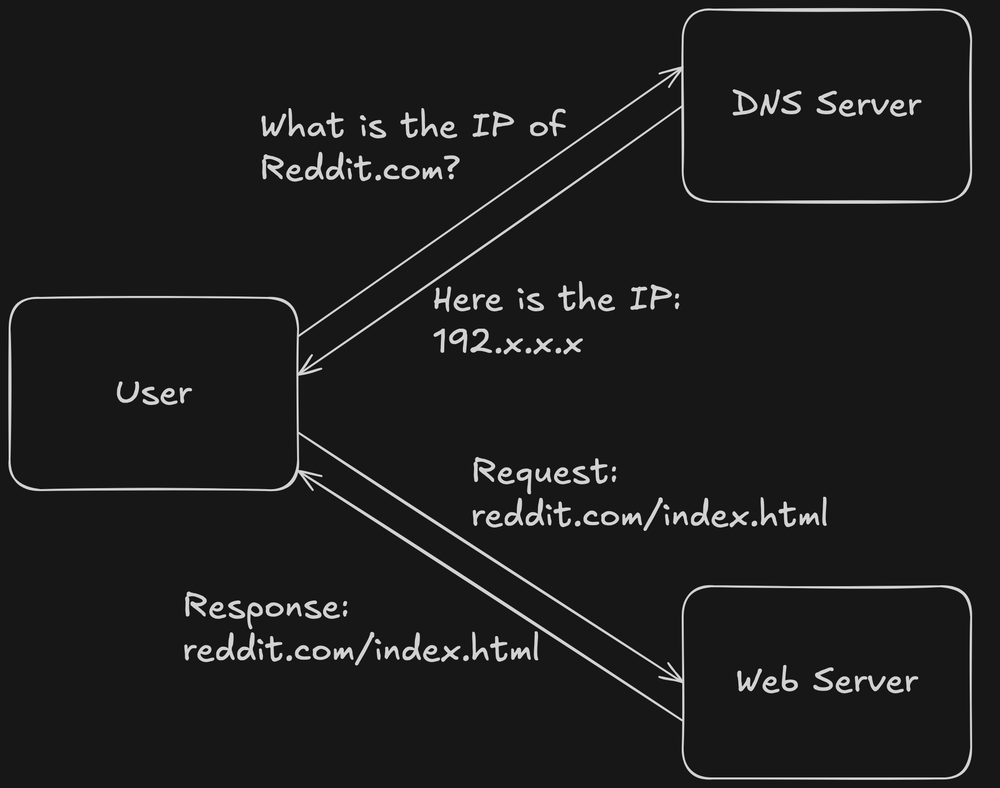
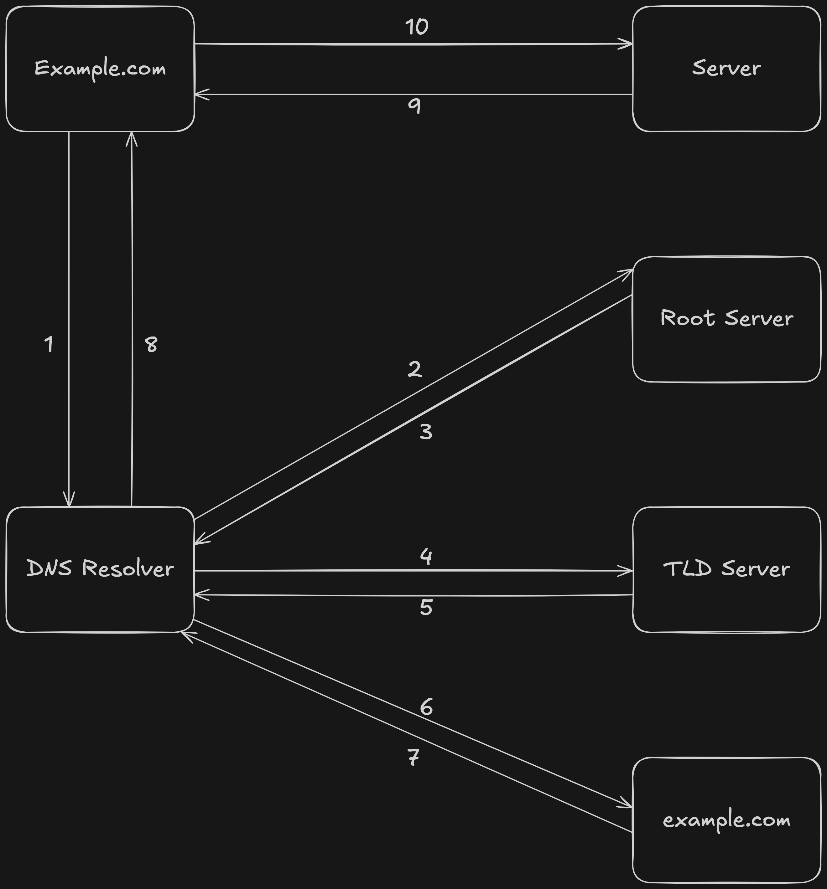

# Design Documentation

## What is DNS?

DNS stands for **Domain Name System**. It essentially acts as a "phone book" of the internet, translating user-friendly domain names into IP addresses that can be used to identify each other on the network.

## What is a DNS Server?

A DNS Server is a **specialized server** that helps translate domain names into IP addresses.

When a user types the name of a website into the browser:

- First the browser looks into its own cache to see if it already knows the IP address for that website.
- If the browser doesn't know, the users computer checks its own DNS cache.
- If the IP is not cached locally, the request is sent to a DNS resolver. **DNS resolver** is a server that receives the query from the DNS client, and then interacts with other DNS servers to hunt down the correct IP. Once the resolver receives the request from the client, the resolver then behaves as a client itself, querying the other three types of DNS servers in search of the right IP.
- If the resolver doesn't have the IP address as well, it asks the **Root DNS Server**.
- The root server replies with the address of **Top-Level Domain Server** for `.com`. The resolver then asks the `.com` server for the IP address.
- The request is then routed to **Authoritative DNS Server** for the IP address. The IP address is then returned to the resolver.
- The DNS resolver sends the IP address back to the browser.

The browser then makes the HTTP request and establishes the connection with the website.

## High Level Architecture: Basic DNS Lookup

## Complete DNS Lookup and Webpage Query

